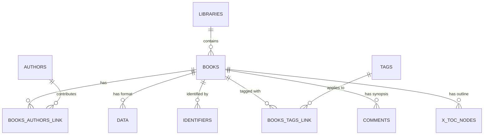

# Data Model: Core Library Model & Calibre Storage

**Feature Branch**: `001-core-library-ingestion`  
**Date**: 2026-09-20  

## 1. Relational Schema Architecture

The database is an embedded SQLite file named `metadata.db` located at the root of each library folder. It implements the Calibre schema while augmenting it with non-intrusive `x_` prefixed tables for advanced features.



---

## 2. Table Definitions

### Calibre Standard Tables

#### `books`
Represents the abstract creative work.
```sql
CREATE TABLE IF NOT EXISTS books (
    id INTEGER PRIMARY KEY AUTOINCREMENT,
    title TEXT NOT NULL DEFAULT 'Unknown',
    sort TEXT,
    timestamp DATETIME DEFAULT CURRENT_TIMESTAMP,
    pubdate DATETIME,
    series_index REAL DEFAULT 1.0,
    author_sort TEXT,
    isbn TEXT,
    lccn TEXT,
    path TEXT NOT NULL,
    flags INTEGER DEFAULT 1,
    uuid TEXT UNIQUE,
    has_cover INTEGER DEFAULT 0,
    last_modified DATETIME DEFAULT CURRENT_TIMESTAMP
);
CREATE INDEX IF NOT EXISTS books_idx ON books (sort COLLATE NOCASE);
```

#### `authors`
Represents writers, editors, and creators.
```sql
CREATE TABLE IF NOT EXISTS authors (
    id INTEGER PRIMARY KEY AUTOINCREMENT,
    name TEXT NOT NULL UNIQUE,
    sort TEXT,
    link TEXT DEFAULT ''
);
CREATE INDEX IF NOT EXISTS authors_idx ON authors (name COLLATE NOCASE);
```

#### `books_authors_link`
Many-to-many relationship linking books and authors.
```sql
CREATE TABLE IF NOT EXISTS books_authors_link (
    id INTEGER PRIMARY KEY AUTOINCREMENT,
    book INTEGER NOT NULL,
    author INTEGER NOT NULL,
    FOREIGN KEY(book) REFERENCES books(id) ON DELETE CASCADE,
    FOREIGN KEY(author) REFERENCES authors(id) ON DELETE CASCADE,
    UNIQUE(book, author)
);
CREATE INDEX IF NOT EXISTS bal_idx ON books_authors_link (book, author);
```

#### `data`
Represents physical book files (EPUB, PDF, MOBI, etc.) associated with a book.
```sql
CREATE TABLE IF NOT EXISTS data (
    id INTEGER PRIMARY KEY AUTOINCREMENT,
    book INTEGER NOT NULL,
    format TEXT NOT NULL,
    uncompressed_size INTEGER NOT NULL,
    name TEXT NOT NULL,
    FOREIGN KEY(book) REFERENCES books(id) ON DELETE CASCADE,
    UNIQUE(book, format)
);
CREATE INDEX IF NOT EXISTS data_idx ON data (book, format);
```

#### `identifiers`
Stores external identifiers (ISBN-10, ISBN-13, DOI, ASIN, Google Books ID).
```sql
CREATE TABLE IF NOT EXISTS identifiers (
    id INTEGER PRIMARY KEY AUTOINCREMENT,
    book INTEGER NOT NULL,
    type TEXT NOT NULL,
    val TEXT NOT NULL,
    FOREIGN KEY(book) REFERENCES books(id) ON DELETE CASCADE,
    UNIQUE(book, type)
);
CREATE INDEX IF NOT EXISTS id_idx ON identifiers (book, type);
```

#### `tags` & `books_tags_link`
Subject headings, genres, and user tags.
```sql
CREATE TABLE IF NOT EXISTS tags (
    id INTEGER PRIMARY KEY AUTOINCREMENT,
    name TEXT NOT NULL UNIQUE
);

CREATE TABLE IF NOT EXISTS books_tags_link (
    id INTEGER PRIMARY KEY AUTOINCREMENT,
    book INTEGER NOT NULL,
    tag INTEGER NOT NULL,
    FOREIGN KEY(book) REFERENCES books(id) ON DELETE CASCADE,
    FOREIGN KEY(tag) REFERENCES tags(id) ON DELETE CASCADE,
    UNIQUE(book, tag)
);
```

#### `comments`
HTML or plain text book description / blurb.
```sql
CREATE TABLE IF NOT EXISTS comments (
    id INTEGER PRIMARY KEY AUTOINCREMENT,
    book INTEGER NOT NULL UNIQUE,
    text TEXT,
    FOREIGN KEY(book) REFERENCES books(id) ON DELETE CASCADE
);
```

---

### xBookLibrary Extension Tables (`x_` prefixed)

#### `x_toc_nodes`
Stores the hierarchical Table of Contents outline extracted from book files.
```sql
CREATE TABLE IF NOT EXISTS x_toc_nodes (
    id INTEGER PRIMARY KEY AUTOINCREMENT,
    book_id INTEGER NOT NULL,
    parent_id INTEGER,
    title TEXT NOT NULL,
    level INTEGER NOT NULL DEFAULT 0,
    page_number INTEGER,
    anchor_href TEXT,
    order_index INTEGER NOT NULL,
    FOREIGN KEY(book_id) REFERENCES books(id) ON DELETE CASCADE,
    FOREIGN KEY(parent_id) REFERENCES x_toc_nodes(id) ON DELETE CASCADE
);
CREATE INDEX IF NOT EXISTS toc_book_idx ON x_toc_nodes (book_id, order_index);
```

#### `x_file_hashes`
Stores SHA-256 hashes of all ingested files for instant byte-level deduplication.
```sql
CREATE TABLE IF NOT EXISTS x_file_hashes (
    id INTEGER PRIMARY KEY AUTOINCREMENT,
    book_id INTEGER NOT NULL,
    format TEXT NOT NULL,
    sha256 TEXT NOT NULL UNIQUE,
    file_path TEXT NOT NULL,
    created_at DATETIME DEFAULT CURRENT_TIMESTAMP,
    FOREIGN KEY(book_id) REFERENCES books(id) ON DELETE CASCADE
);
CREATE INDEX IF NOT EXISTS hash_idx ON x_file_hashes (sha256);
```

#### `x_ingestion_jobs`
Tracks asynchronous batch import jobs.
```sql
CREATE TABLE IF NOT EXISTS x_ingestion_jobs (
    id TEXT PRIMARY KEY,
    status TEXT NOT NULL, -- PENDING, PROCESSING, COMPLETED, FAILED
    total_files INTEGER DEFAULT 0,
    processed_files INTEGER DEFAULT 0,
    error_log TEXT, -- JSON array of error objects
    created_at DATETIME DEFAULT CURRENT_TIMESTAMP,
    completed_at DATETIME
);
```

---

## 3. Global Application Registry (`~/.xbooklibrary/config.json`)

To keep libraries completely portable and decoupled, global settings and registered library locations are stored outside the libraries:
```json
{
  "active_library_id": "lib-personal-01",
  "libraries": [
    {
      "id": "lib-personal-01",
      "name": "Main Library",
      "path": "C:\\MyBooks\\MainLibrary",
      "is_calibre_adopted": true,
      "auto_watch": true,
      "auto_import_folder": "C:\\MyBooks\\MainLibrary\\_auto_import"
    }
  ],
  "preferences": {
    "theme": "dark",
    "default_page_size": 50,
    "gemini_api_key": ""
  }
}
```
