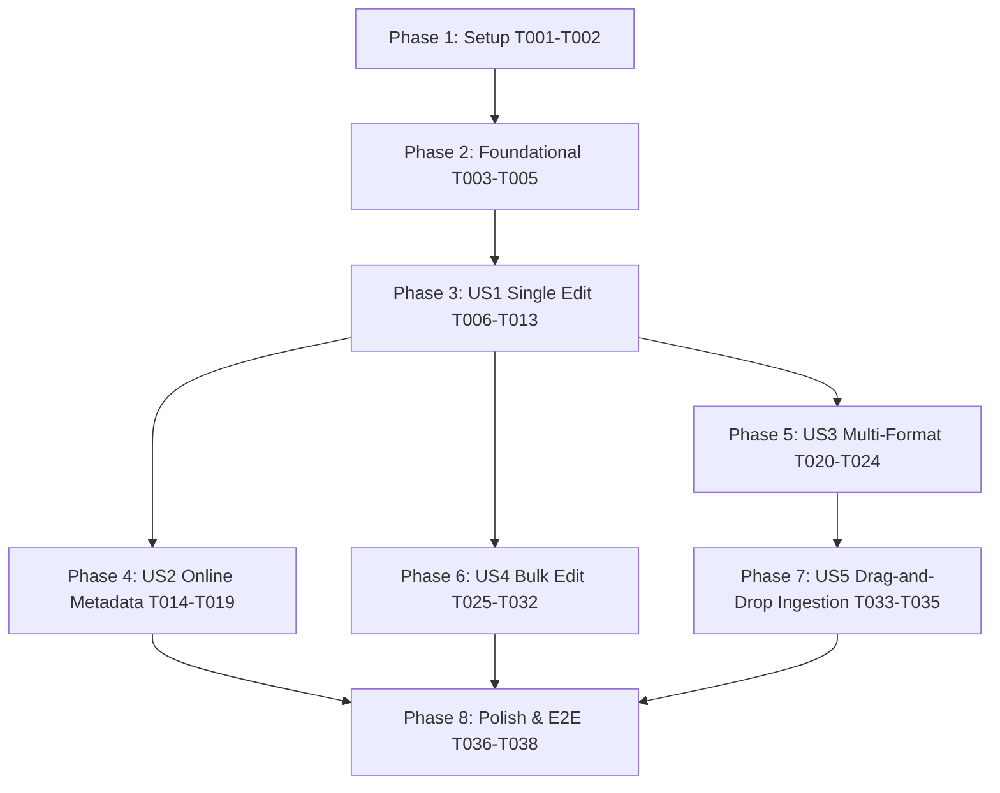

# Tasks: Feature 015 - Core Library Operations, In-Place Metadata Editor & Multi-Format Ingestion

**Feature**: `015-core-metadata-editor-and-import`  
**Input**: [spec.md](file:///c:/sac/progs/xBookLibrary/specs/015-core-metadata-editor-and-import/spec.md), [data-model.md](file:///c:/sac/progs/xBookLibrary/specs/015-core-metadata-editor-and-import/data-model.md), [research.md](file:///c:/sac/progs/xBookLibrary/specs/015-core-metadata-editor-and-import/research.md), [plan.md](file:///c:/sac/progs/xBookLibrary/specs/015-core-metadata-editor-and-import/plan.md), [contracts/openapi.yaml](file:///c:/sac/progs/xBookLibrary/specs/015-core-metadata-editor-and-import/contracts/openapi.yaml)

---

## Phase 1: Setup & Dependencies

- [X] T001 Verify Python dependencies (`httpx`, `pillow`, `lxml`) and Node dependencies (`lucide-react`) in `pyproject.toml` and `frontend/package.json`
- [X] T002 Update `.specify/feature.json` to point to `specs/015-core-metadata-editor-and-import`

---

## Phase 2: Foundational Data Models & Shared Infrastructure

Prerequisites for all User Stories:

- [X] T003 [P] Implement Pydantic data schemas (`BookMetadataUpdateRequest`, `OnlineMetadataCandidate`, `BulkMetadataUpdateRequest`, `BulkMetadataUpdateResult`, `FormatAddResponse`, `FormatDeleteResponse`) in `backend/domain/metadata_editor.py`
- [X] T004 [P] Implement `metadata.opf` XML generation & atomic sync engine in `backend/services/opf_sync_service.py`
- [X] T005 Update TypeScript domain models in `frontend/src/types/index.ts` to include `BookMetadataUpdateRequest`, `OnlineMetadataCandidate`, `BulkMetadataUpdateRequest`, and format management types

---

## Phase 3: User Story 1 - Comprehensive Single-Book Metadata Editor (Priority: P1)

**Story Goal**: Allow users to open an in-place "Edit Metadata" modal (via UI button or `E` key) for any selected book, edit all standard Calibre metadata fields, paste or upload cover art, and atomically synchronize `metadata.db` and `metadata.opf`.

**Independent Test**:
- Open the metadata editor modal for book ID 1.
- Edit Title to "Dune (Enhanced Edition)", Authors to "Frank Herbert", Series to "Dune Chronicles", Series Index to 1.5, Publisher to "Chilton Books", Tags to ["Sci-Fi", "Classic", "Hugo Award"], and Rating to 5.
- Paste a new JPEG image into the cover box.
- Save and verify response is 200; verify `metadata.db` reflects linked relations in `authors`, `tags`, `series`, and `publishers`, `metadata.opf` matches on disk, and `cover.jpg` is updated.

### Implementation Tasks
- [X] T006 [US1] Create unit tests for transactional metadata update and relational integrity in `tests/unit/test_metadata_editor_service.py`
- [X] T007 [US1] Implement `MetadataEditorService.update_book_metadata()` with Calibre relational updates (`authors`, `tags`, `series`, `publishers`, `ratings`, `identifiers`, `comments`, `sort`, `author_sort`) in `backend/services/metadata_editor_service.py`
- [X] T008 [US1] Implement `MetadataEditorService.save_book_cover()` with image normalization to RGB JPEG and thumbnail cache busting in `backend/services/metadata_editor_service.py`
- [X] T009 [US1] Implement REST API endpoints `PUT /api/books/{book_id}/metadata` and `POST /api/books/{book_id}/cover` in `backend/api/books_router.py`
- [X] T010 [US1] Add client API methods `updateBookMetadata()` and `uploadBookCover()` in `frontend/src/api/client.ts`
- [X] T011 [US1] Add single-book edit modal state (`isEditMetadataOpen`, `setEditMetadataOpen`) and global shortcut listener (`E`) in `frontend/src/store/useStore.ts` and `frontend/src/App.tsx`
- [X] T012 [US1] Create `frontend/src/components/metadata/EditMetadataModal.tsx` supporting title, authors, sort keys, series, rating stars, tag chip input, identifiers, comments rich editor, and cover drop/paste preview
- [X] T013 [US1] Add "Edit Metadata" action button and `E` keyboard hint to `frontend/src/components/DetailInspector.tsx` and context menu

---

## Phase 4: User Story 2 - Interactive Online Metadata & Cover Fetching (Priority: P1)

**Story Goal**: Provide an interactive drawer inside the metadata editor to query Google Books and OpenLibrary concurrently, display ranked candidate cards with cover previews and confidence scores, and selectively apply desired fields to the book.

**Independent Test**:
- From the Edit Metadata modal, click "Download Metadata".
- Enter query "Foundation Isaac Asimov" or ISBN "9780553293357".
- View candidate cards with cover thumbnails, publisher, and year.
- Click "Apply Candidate" and confirm that title, author, description, tags, publisher, and high-res cover populate the editor form.

### Implementation Tasks
- [X] T014 [US2] Implement unit tests for online query parsing and candidate ranking in `tests/unit/test_online_metadata_service.py`
- [X] T015 [US2] Implement `OnlineMetadataService.search_metadata()` querying Google Books API and OpenLibrary API concurrently with retry logic and timeout in `backend/services/online_metadata_service.py`
- [X] T016 [US2] Implement REST API endpoint `POST /api/books/{book_id}/online-metadata/query` in `backend/api/books_router.py`
- [X] T017 [US2] Add client API method `queryOnlineMetadata()` in `frontend/src/api/client.ts`
- [X] T018 [US2] Create `frontend/src/components/metadata/OnlineMetadataDrawer.tsx` with candidate card list, thumbnail preview, confidence indicators, and field-by-field merge checkboxes
- [X] T019 [US2] Integrate `OnlineMetadataDrawer` into `frontend/src/components/metadata/EditMetadataModal.tsx`

---

## Phase 5: User Story 3 - Multi-Format Attachment & Deletion (Priority: P2)

**Story Goal**: Enable multi-format container management where users can upload or attach additional format files (e.g. adding a PDF to an existing EPUB) or delete an obsolete format directly from the Detail Inspector without deleting the book.

**Independent Test**:
- Select an existing EPUB book.
- In Detail Inspector under "Formats", click "+ Add Format" and select a valid PDF file.
- Verify API returns 201 with updated format list; verify physical file exists in `{author}/{title}/` and row is in `data` table.
- Click "Delete" on the MOBI format chip, confirm prompt, and verify file is deleted from disk and row removed from `data`.

### Implementation Tasks
- [X] T020 [US3] Implement unit tests for format ingestion and format deletion in `tests/unit/test_format_management.py`
- [X] T021 [US3] Implement `MetadataEditorService.attach_format()` and `MetadataEditorService.delete_format()` in `backend/services/metadata_editor_service.py`
- [X] T022 [US3] Implement REST API endpoints `POST /api/books/{book_id}/formats` and `DELETE /api/books/{book_id}/formats/{format}` in `backend/api/books_router.py`
- [X] T023 [US3] Add client API methods `attachBookFormat()` and `deleteBookFormat()` in `frontend/src/api/client.ts`
- [X] T024 [US3] Add multi-format file upload picker, format badges, and delete confirmation button in `frontend/src/components/DetailInspector.tsx`

---

## Phase 6: User Story 4 - Bulk Multi-Book Metadata Editor (Priority: P2)

**Story Goal**: Support multi-book selection across Table and Grid views, showing a floating bulk action bar and opening a Bulk Edit modal to batch-update tags, author, publisher, rating, or auto-increment series indices.

**Independent Test**:
- Multi-select 3 books in Table or Grid view.
- Click "Bulk Edit (3)" in the bottom action bar.
- Add tag "Summer Reading", remove tag "Unread", set Publisher to "Tor Books", and set Series to "Remembrance of Earth's Past" with auto-increment.
- Click "Apply to 3 Books" and verify all 3 books are updated with indices 1.0, 2.0, 3.0 and modified tags.

### Implementation Tasks
- [X] T025 [US4] Implement unit tests for bulk update logic and series auto-incrementation in `tests/unit/test_bulk_metadata_service.py`
- [X] T026 [US4] Implement `MetadataEditorService.bulk_update_books()` handling transactional updates across books in `backend/services/metadata_editor_service.py`
- [X] T027 [US4] Implement REST API endpoint `POST /api/books/bulk-update` in `backend/api/books_router.py`
- [X] T028 [US4] Add client API method `bulkUpdateBooks()` in `frontend/src/api/client.ts`
- [X] T029 [US4] Implement selection state (`selectedBookIds`, `toggleSelectBookId`, `selectAllBooks`, `clearSelectedBooks`) in `frontend/src/store/useStore.ts`
- [X] T030 [US4] Add multi-selection checkboxes and Shift+Click range selection to `frontend/src/components/BookTable.tsx` and `frontend/src/components/BookGrid.tsx`
- [X] T031 [US4] Create floating `frontend/src/components/metadata/BulkActionBar.tsx` with selection count and "Bulk Edit", "Export", and "Clear" actions
- [X] T032 [US4] Create `frontend/src/components/metadata/BulkEditModal.tsx` supporting Add Tags, Remove Tags, Set Author, Set Publisher, Set Rating, and Series auto-numbering

---

## Phase 7: User Story 5 - Streamlined Drag-and-Drop Ingestion with Conflict Handling (Priority: P3)

**Story Goal**: Provide an effortless global drag-and-drop dropzone with format badges and an interactive duplicate resolution prompt (Merge format, Create separate book, or Skip).

**Independent Test**:
- Drag an e-book file anywhere over the main catalog window.
- Verify visual dropzone overlay appears with supported format hints.
- Drop a book file whose title and author match an existing library book.
- Verify conflict modal appears: "Merge format into existing book", "Create new separate book", or "Skip".

### Implementation Tasks
- [X] T033 [US5] Implement duplicate detection and resolution logic in `backend/services/ingestion_service.py`
- [X] T034 [US5] Add global drag-and-drop listener and visual overlay in `frontend/src/App.tsx`
- [X] T035 [US5] Create duplicate conflict prompt modal in `frontend/src/components/metadata/ImportConflictModal.tsx`

---

## Phase 8: Polish & Cross-Cutting Concerns

- [X] T036 Ensure keyboard accessibility for all modals (`Esc` to close, `Ctrl+Enter` to save, arrow key navigation) in `frontend/src/components/metadata/`
- [X] T037 Add toast notifications for successful metadata saves, cover uploads, and bulk operations in `frontend/src/store/useStore.ts`
- [X] T038 Create comprehensive Playwright end-to-end test in `tests/e2e/test_metadata_editor_and_import.spec.ts` verifying single-book edit, online metadata fetch, multi-format management, and bulk editing

---

## Dependencies & Execution Order

### Parallel Opportunities:
- **Phase 2**: T003 (Pydantic models) and T004 (OPF service) can be built in parallel.
- **Phase 3 vs Phase 5**: Once Foundational Phase 2 is complete, single edit (US1) and multi-format attachment (US3) backend models can proceed independently.
- **Frontend Components**: `EditMetadataModal.tsx` (T012) and `BulkEditModal.tsx` (T032) share design system tokens and can be developed once store types (T005, T029) are defined.

---

## Implementation Strategy & MVP Scope

- **MVP Scope**: Phase 1 + Phase 2 + Phase 3 (User Story 1: Comprehensive Single-Book Metadata Editor) + Phase 4 (User Story 2: Interactive Online Metadata Fetching).
- **Subsequent Increments**: Phase 5 (Multi-Format Attachment) $\rightarrow$ Phase 6 (Bulk Editor) $\rightarrow$ Phase 7 (Drag-and-Drop Ingestion) $\rightarrow$ Phase 8 (Polish & Automated Playwright E2E).
